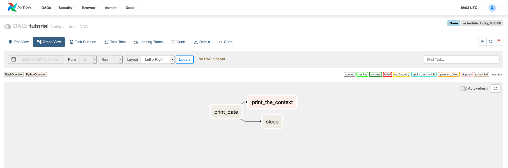
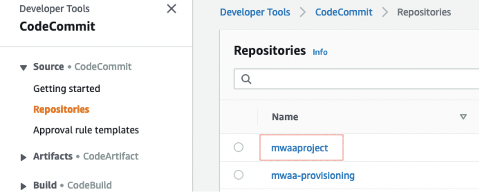
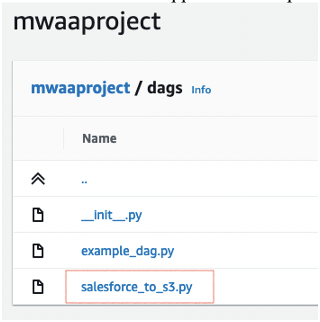
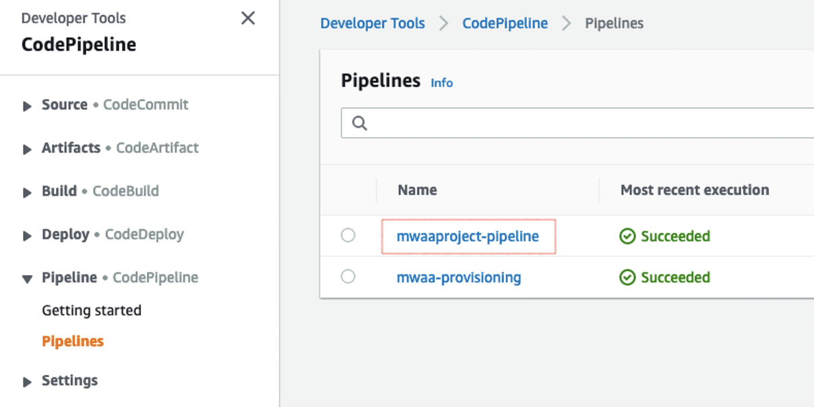
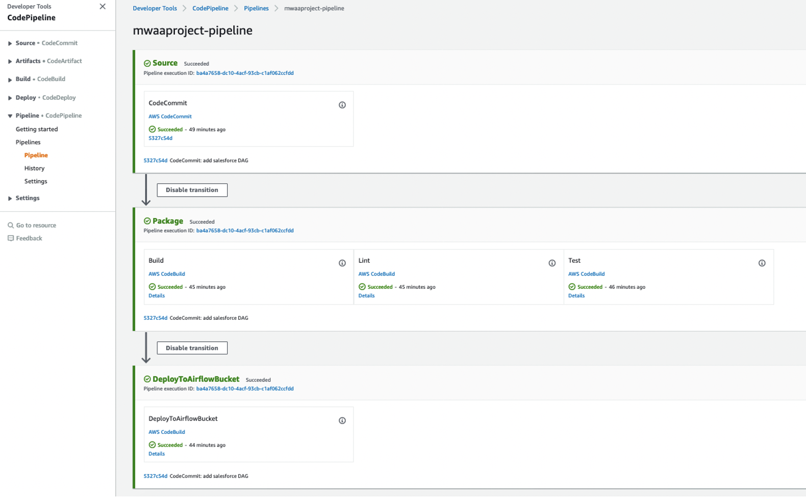
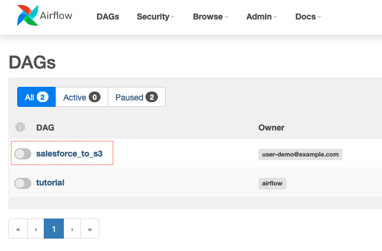

# Automating Amazon Managed Workflows for Apache Airflow (MWAA) using AWS Cloud Development Kit (CDK)

## Purpose
The purpose of this solution is to automate the deployment and configuration of Managed Apache Airflow environments to programmatically author, schedule and monitor workflows.

This solution includes two CI/CD pipelines:
* The provisioning CI/CD Pipeline helps the **MWAA Admins** teams to:
    * Automate MWAA environments deployment
    * Automate Plugins and Requirements management for MWAA deployed environments 
* The project CI/CD Pipeline helps the **MWAA Users** teams to:
    * Start a python project with builtin DevOps best practices
    * Continuously integrate and deploy their code and DAGs


## Prerequisites  

* Prepare an AWS account (https://aws.amazon.com/premiumsupport/knowledge-center/create-and-activate-aws-account/) to be used for the installation
* Install the AWS Cloud Development Kit (https://aws.amazon.com/cdk/)
* Prepare Python 3.7 or newer environment

## Stack parameters 

By default, the stack deploys a basic MWAA environment with the associated pipelines described previously. It will create a new VPC in order to host the MWAA resources.
The stack can be customized using the following parameters. To pass a paramater you should use the following command: 

````shell
cdk deploy -c paramName=paramValue
````

| Parameter  |  Description |  Default | Valid values |
|---|---|---|---|
| vpcId | VPC ID where the cluster will be deployed. If none creates a new one and needs the parameter **cidr** in that case| None | VPC ID |
| cidr | The cidr for the VPC that will be created to host MWAA resources. Used only if the **vpcId** is not defined. | 172.31.0.0/16 | IP CIDR |
| subnetIds | Comma separated list of subnets IDs where the cluster will be deployed. If None looks for private subnets in the same AZ | None | Subnet IDs list (coma separated) |   
| envName | MWAA Environment Name | MwaaEnvironment | String |   
| envTags | MWAA Environment Tags | None | json ex. '{"Environment":"MyEnv","Application":"MyApp","Reason":"Airflow"}' | 
| environmentClass | MWAA Environment Class | mw1.small | mw1.small, mw1.medium, mw1.large |   
| maxWorkers | MWAA Max Workers | 1 | int |     
| webserverAccessMode | MWAA Environment Access mode (private/public) | PUBLIC_ONLY | PUBLIC_ONLY, PRIVATE_ONLY |   
| secretsBackend | MWAA Environment Secrets Backend | Airflow | Airflow, SecretsManager |   

## Deployment 

* Before using AWS CDK you need to bootstrap your AWS account following the AWS guide here: https://docs.aws.amazon.com/cdk/latest/guide/bootstrapping.html
    Quick command:
    ````shell
    cdk bootstrap aws://YOUR_ACCOUNT_ID/YOUR_REGION
    ````

* Define CDK environment variables  
    On Linux or MacOS
    ````shell
    export CDK_DEFAULT_ACCOUNT=YOUR_ACCOUNT_ID
    export CDK_DEFAULT_REGION=YOUR_REGION
    ````  
    On Windows
    ````shell
    setx CDK_DEFAULT_ACCOUNT YOUR_ACCOUNT_ID
    setx CDK_DEFAULT_REGION YOUR_REGION
    ````

* Launch the Stack  
Replace the `<YOUR_VPC_ID>` with your VPC ID or refer to the parameters description to create a new VPC by passing a `cidr` parameter and run the following command:  
    ````shell
    cd mwaairflow && \
    pip install . && \
    cdk synth && \
    cdk deploy -c vpcId=<YOUR_VPC_ID>
    ````

## MWAA is Ready !
This solution deploys a tutorial DAG for your teams to get started !



## Deploy your DAG using the Project CI/CD Pipeline  

As part of the CDK deployment, an [AWS CodeCommit](https://aws.amazon.com/codecommit/) and an [AWS CodePipeline](https://aws.amazon.com/codepipeline/) were created in order to continuously build, test and deploy DAGs into your MWAA environment.
To deploy the new DAG, the source code should be committed to the CodeCommit repository. This will trigger a CodePipeline run that will build, test and deploy your new DAG and make it available in your MWAA environment. 
To do so, follow the steps below:

* Login to the [CodeCommit console](https://console.aws.amazon.com/codecommit/) in your deployment region.
* Under **Source** > **Repositories** you should see a new repository **mwaaproject**.
    
* Push your new **DAG** in **mwaaproject** repository under **dags**. You can either use the CodeCommit console or Git command-line to do so.
    
* The new commit triggers a new CodePipeline that will build, test and deploy the new DAG. To the check the Pipeline execution login to CodePipeline console. Under **Pipeline** > **Pipelines** you should see **mwaaproject-pipeline**.
    
* Click on **mwaaproject-pipeline** name to display its details.
    
* After checking that the pipeline run is successful, you can verify that the DAG is deployed to the S3 bucket and therefore available in MWAA Console.
    


## Cleanup
To clean up the deployed resources, you can simply run the following command:  
````shell
cdk destroy
````   
Make sure you are in the root path of the project when you run the command.


## Security

See [CONTRIBUTING](CONTRIBUTING.md#security-issue-notifications) for more information.

## License

This library is licensed under the MIT-0 License. See the LICENSE file.
